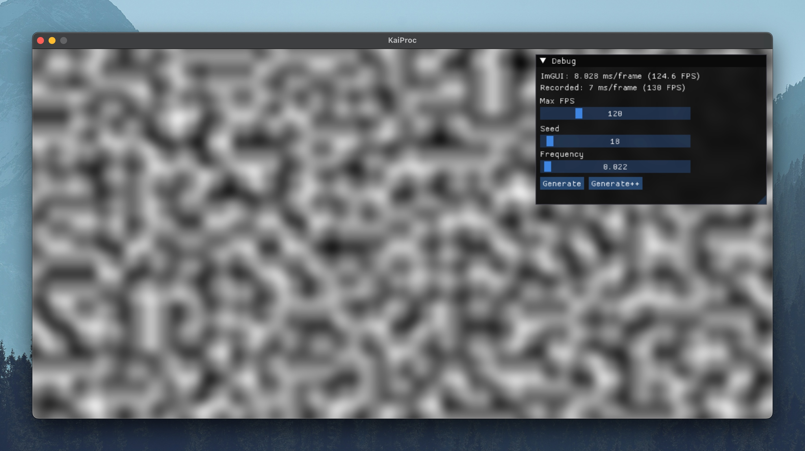
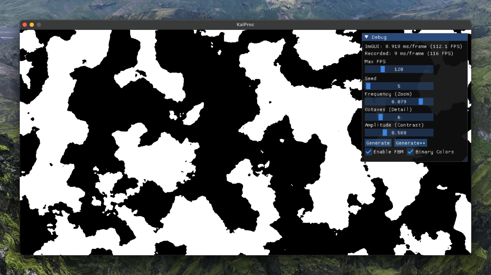

# Kai Procedural Generation (KaiProc / KPG)

Exploring various proc gen tools.

Goal of having a nice 2D dungeon/terrain generator for a top down tile based game.


## Summary

## Getting Started

**Building**

```bash
git clone <url>
git submodule update --init --recursive
mkdir build
cd build
cmake ..
make
```

**Running**
```bash
./kaiproc
```
## Screenshots



